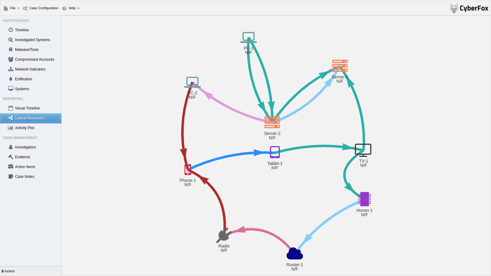

# Aurora Incident Response

Incident Response Documentation made easy. Developed by Incident Responders for Incident Responders.
Aurora brings "Spreadsheet of Doom" used in the SANS FOR508 class to the next level. Having led many cases and taught so many students how to do IR right, I realized, that many struggle
with keeping control over all the findings. That does not only prevent them from seeing what they already have, but even less so what they are missing. 

It's intended to be used in small and big incident response investigations to track findings, tasks, making reporting easy and generally stay on top of the game. The current version has been battle tested multiple times now. 
I'll keep fixing bugs and ading features as we go, but please remember, it's a leisure time project. So any help is appreciated.

Lateral Movement

Visual Timeline

## 1 Download & Installation

You can download the current release of Aurora Incident Response from the [Releases Page](https://github.com/cyb3rfox/Aurora-Incident-Response/releases).
Aurora Incident Response is available for MacOS, Windows and Linux. We are working on making it available for
iPads and Android tablets as well.

Here's a video on how to use Aurora:

## 2 Development

If you want to contribute, you are encouraged to do so. I'd totally like to see the tool growing. 
The whole application is built on an electron base and written in plain Javascript and HTML.
Even though technically I could have used node.js modules for functionality like Webdav I refrained from it.
The reason is, that node modules will not run out of the box when migrating the code to phonegap for IOS and Android.
The good news is, it's really fast to set uo your development environment. I personally use Webstorm but it should work with pretty much any IDE.

### 2.1 Set up your build environment

As pointed out in the description, Aurora Incident Response is built ib top of Electron which allows for multi platform compatibility.
You can easily install your tool chain the following way.

Start by installing `node.js`. Follow the links to their [download page](https://nodejs.org/en/download/).

With `nodejs` installed, checkout the [Aurora Github repository](git clone https://github.com/cyb3rfox/Aurora-Incident-Response) (or fork first if you want to contribute).

<code>git clone https://github.com/cyb3rfox/Aurora-Incident-Response </code>

<code>cd Aurora-Incident-Response/src
</code>

Now you need to install Electron using node. Currently Aurora is configured to run with `electron` 4.0.6. 

<code>npm install electron@4.0.6 </code>

You can now run the code by invoking:

<code>node_modules/.bin/electron .</code>

That's fast, isn't it?

### 2.2 Roadmap

The following points are already on the roadmap. Please just post a new issue or send a message on [Twitter](https://twitter.com/cyberfox) if you got any suggestions for new improvements.

You can checkout the planned feature for the nex releases under [projects](https://github.com/cyb3rfox/Aurora-Incident-Response/projects).

### 2.3 Build executables for distribution

To build and cross build you I use `electron-packager`.
 
<code>npm install electron-packager</code>

Build for Windows:

<code>./node_modules/.bin/electron-packager . Aurora --asar --prune --platform=win32 --electron-version=4.0.6 --arch=x64 --icon=icon/aurora.ico --out=release-builds --ignore "node_modules/\.bin" </code>

Build for MacOS:

<code>./node_modules/.bin/electron-packager ./src Aurora --overwrite --platform=darwin --arch=x64 --icon=icon/aurora.icns --prune=true --out=release-builds </code>

Build for Linux:

<code>./node_modules/.bin/electron-packager . Aurora --asar --prune --platform=linux --electron-version=4.0.6 --arch=x64 --icon=icon/aurora.ico --out=release-builds --ignore "node_modules/\.bin" </code>

### 2.4 Sourcecode Navigator

This section describes the various sourcecode files. For now I need to keep this section small. I tried to comment in the code as good as I can. If you got any questions, just ping me. If you want to join me developing the tool, there's a slack channel to communicate. Drop me a note and I will invite you.

#### 2.4.1 `main.js`

Electron apps differentiates between a main (background) and a render process(chromium browser window). This file controls the main process. 
For aurora you usually only need to go there if you want to turn on the Javascript console in the Aurora window. Just unquote the following line:

<code>win.webContents.openDevTools()</code> 

The second thing that's handled there is autosaving and unlocking when you exit the program. For that the main and the render process share a global variable called <code>global.Dirty.is_dirty</code> that is used to signal to the main process if it can quit right away or if the file needs to be sanitized before exiting.
It's actually a very similar concept to the NTFS dirty bit.
 
#### 2.4.2 `index.html`
`
This is the main Aurora file that strings together all scripts and stylesheets. It also initiates the GUI. other than that it has no functionality.
 
#### 2.4.3 `gui_definitions.js`

I tried as good as I can to separate code an design. This file holds all the definition json for the `w2ui` GUI. There is some code left in there
for the renderers that format certain columns. It didn't make sense to place them anywhere else.
 
#### 2.4.4 `controller.js`

The controller injects the handling functions for gui events. So whenever a button is pressed, or any other event needed happens, controller.js handles what happens.
 
#### 2.4.5 `gui_functions.js`

Every now and then operations happen that change something in the GUI. That could e. g. be making all the datafields readonly when you don't have the lock or simply opening a popup.
All these functions are located in this file which is a plain JSON file.
  
#### 2.4.6 `data.js`

While the actual data is stored in the `w2ui` datasctructures, for saving and some other operations we need to bring it into out format. 
Transformations like this and all logic regarding saving and opening files is located here.
 
#### 2.4.7 `data_template.js`
  
This holds templates for the internal data format of that version. Current format version is 3. 
 
#### 2.4.8 `misp.js`
 
Code for MISP integration.
 
#### 2.4.9 `virustotal.js`
  
Code for VT integration.
 
#### 2.4.10 `settings.js`
 
Settings for different libraries. Currently only defines the time field format for `w2ui`.
 
#### 2.4.11 `helper_functions.js`

Small helper functions that do not fit anywhere else.

#### 2.4.12 `import.js`

Handles CSV imports

#### 2.4.13 `exports.js`

Handles CSV exports

## 3 Licensing

Aurora is licensed under the Apache 2 License.

## 4 Credits
Projects like this can only be realized because many people invested thousands of hours into writing cool libraries and other software. Others contribute professional UI items. Thank you for all your great work. Namely I build Aurora based on the following dependencies:

* Electron https://www.electronjs.org
* jquery https://jquery.com
* w2ui http://w2ui.com/web/
* vis.js https://visjs.org
* icons8 https://icons8.com
* Fontawsome https://fontawesome.com

Besides the incredible amount of work that people invested into these projects, you need other support as well. Writing the code is easy, but making it a tool the works in reality depends on a vast amount of experience from many incident responders. 
Here I particularly want to mention the members of my IR team who contributed their knowledge and helped testing the tool in real world cases:

* Rothi
* Bruno
* Sandro

Even though this is a side and weekend project it's still good to know, that my employer Infoguard AG supports me in any way they can. Thank you particularly to:

* Ernesto
* Thomas

The following people have contributed changes that have a significant impact on the tool:

* Félix Brezo, Ph. D. (working on visualization parts)

