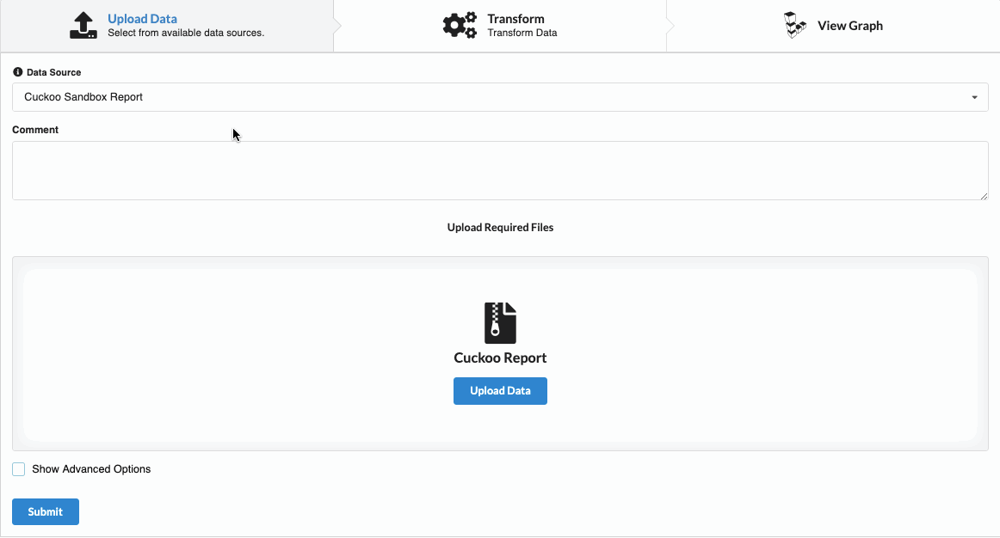
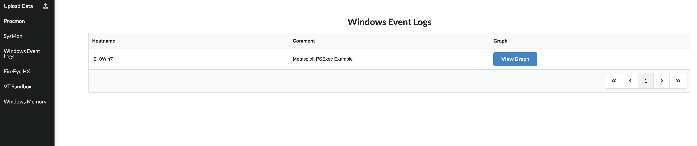
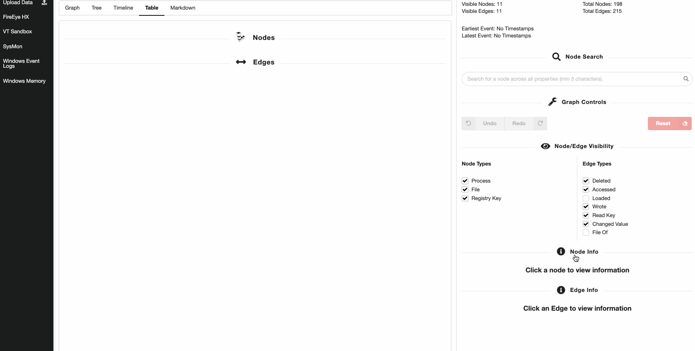
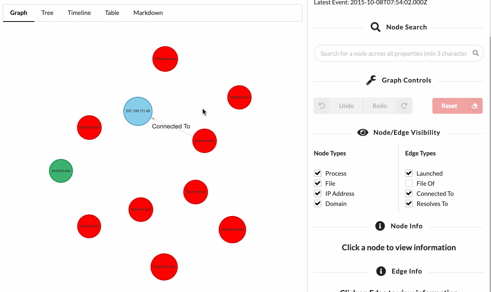
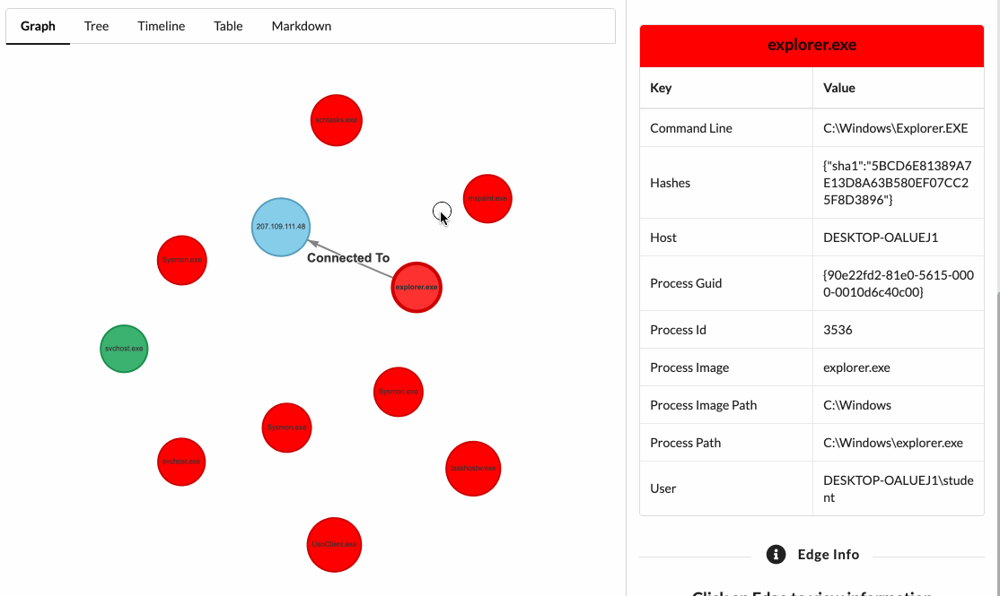
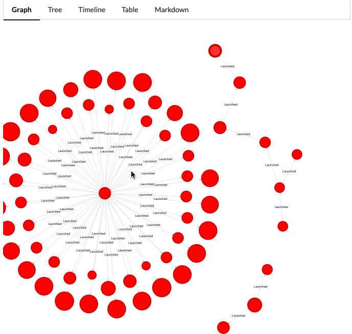
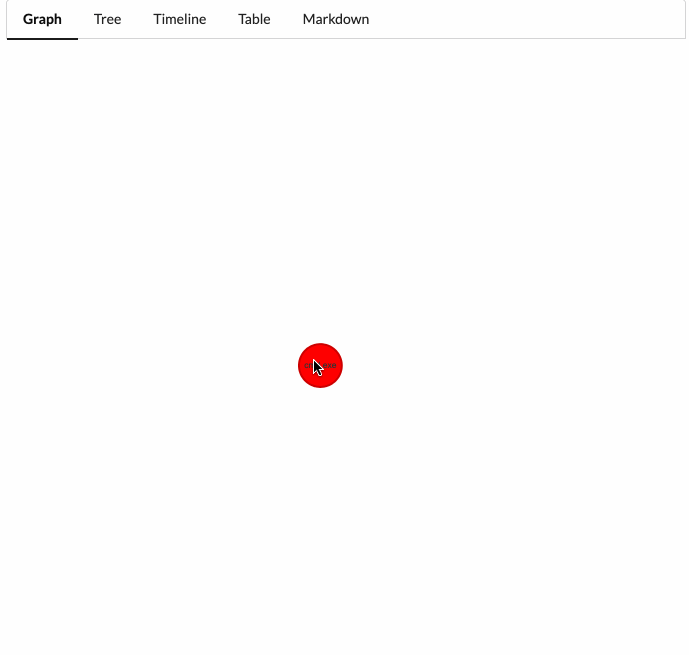
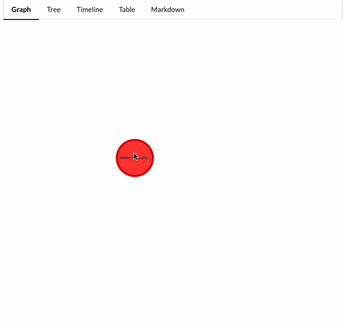
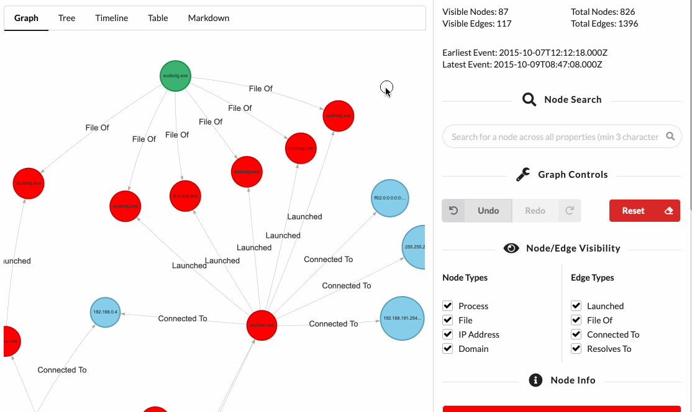

# Beagle

[](https://travis-ci.com/yampelo/beagle) [](https://codecov.io/gh/yampelo/beagle) [](https://beagle-graphs.readthedocs.io/en/latest/?badge=latest) [](https://hub.docker.com/r/yampelo/beagle) [](https://pypi.org/project/pybeagle/) [](https://join.slack.com/t/beaglegraph/shared_invite/enQtNjE1MzQyNTE3NTI3LTUzMGNhMzcwN2M5ODg3NGRmNzVmM2ZjMmU0NDk3ODEwMmRkZjEyZWIxYzU5NmM3MWMxOWU4MjVhNWEyNWVkNTI)

<!-- @import "[TOC]" {cmd="toc" depthFrom=2 depthTo=4 orderedList=true} -->

<!-- code_chunk_output -->

1. [About Beagle](#about-beagle)
2. [Installation](#installation)
    1. [Docker](#docker)
    2. [Python Package](#python-package)
    3. [Configuration](#configuration)
3. [Web Interface](#web-interface)
    1. [Uploading Data](#uploading-data)
    2. [Browsing Existing Graphs](#browsing-existing-graphs)
    3. [Graph Interface](#graph-interface)
        1. [Inspecting Nodes and Edges](#inspecting-nodes-and-edges)
        2. [Expanding Neighbours](#expanding-neighbours)
        3. [Hiding Nodes](#hiding-nodes)
        4. [Running Mutators](#running-mutators)
        5. [Toggling Node and Edge Types](#toggling-node-and-edge-types)
        6. [Undo/Redo Action and Reset](#undoredo-action-and-reset)
        7. [Graph Perspectives](#graph-perspectives)
4. [Python Library](#python-library)
    1. [Controlling Edge Generation](#controlling-edge-generation)
    2. [Loading Saved JSON](#loading-saved-json)
5. [Documentation](#documentation)

<!-- /code_chunk_output -->

## About Beagle

Beagle is an incident response and digital forensics tool which transforms data sources and logs into graphs. Supported data sources include FireEye HX Triages, Windows EVTX files, SysMon logs and Raw Windows memory images. The resulting Graphs can be sent to graph databases such as Neo4J or DGraph, or they can be kept locally as Python `NetworkX` objects.

Beagle can be used directly as a python library, or through a provided web interface.

<center>

</center>

The library can be used either as a sequence of functional calls from a single datasource.

```python
>>> from beagle.datasources import SysmonEVTX

>>> graph = SysmonEVTX("malicious.evtx").to_graph()
>>> graph
<networkx.classes.multidigraph.MultiDiGraph at 0x12700ee10>
```

As a graph generated from a set of multiple artifacts

```python
>>> from beagle.datasources import SysmonEVTX, HXTriage, PCAP
>>> from beagle.backends import NetworkX

>>> nx = NetworkX.from_datasources(
    datasources=[
        SysmonEVTX("malicious.evtx"),
        HXTriage("alert.mans"),
        PCAP("traffic.pcap"),
    ]
)
>>> G = nx.graph()
<networkx.classes.multidigraph.MultiDiGraph at 0x12700ee10>
```

Or by strictly calling each intermediate step of the data source to graph process.

```python
>>> from beagle.backends import NetworkX
>>> from beagle.datasources import SysmonEVTX
>>> from beagle.transformers import SysmonTransformer

>>> datasource = SysmonEVTX("malicious.evtx")

# Transformers take a datasource, and transform each event
# into a tuple of one or more nodes.
>>> transformer = SysmonTransformer(datasource=datasource)
>>> nodes = transformer.run()

# Transformers output an array of nodes.
[
    (<SysMonProc> process_guid="{0ad3e319-0c16-59c8-0000-0010d47d0000}"),
    (<File> host="DESKTOP-2C3IQHO" full_path="C:\Windows\System32\services.exe"),
    ...
]

# Backends take the nodes, and transform them into graphs
>>> backend = NetworkX(nodes=nodes)
>>> G = backend.graph()
<networkx.classes.multidigraph.MultiDiGraph at 0x126b887f0>
```

Graphs are centered around the activity of individual **processes**, and are meant primarily to help analysts investigate activity on hosts, not between them.

## Installation

### Docker

Beagle is available as a docker file:

```bash
docker pull yampelo/beagle
mkdir -p data/beagle
docker run -v "$PWD/data/beagle":"/data/beagle" -p 8000:8000 yampelo/beagle
```

### Python Package

It is also available as library. Full API Documentation is available on [https://beagle-graphs.readthedocs.io](https://beagle-graphs.readthedocs.io)

```
pip install pybeagle
```

_Note: Only Python 3.6+ is currently supported._

Rekall is not automatically installed. To install Rekall execute the following command instead:

```
pip install pybeagle[rekall]
```

### Configuration

-   [Complete overview of each configuration entry](docs/configuration.md)

Any entry in the [configuration file](https://github.com/yampelo/beagle/blob/master/beagle/config_templates/beagle_default.cfg) can be modified using environment variables that follow the following format: `BEAGLE__{SECTION}__{KEY}`. For example, in order to change the VirusTotal API Key used when using the docker image, you would use `-e` parameter and set the `BEAGLE__VIRUSTOTAL__API_KEY` variable:

```bash
docker run -v "data/beagle":"/data/beagle" -p 8000:8000 -e "BEAGLE__VIRUSTOTAL__API_KEY=$API_KEY" beagle
```

Environment variables and directories can be easily defined using docker compose

```docker
version: "3"

services:
    beagle:
        image: yampelo/beagle
        volumes:
            - /data/beagle:/data/beagle
        ports:
            - "8000:8000"
        environment:
            - BEAGLE__VIRUSTOTAL__API_KEY=$key$
```

## Web Interface

Beagle's docker image comes with a web interface that wraps around the process of both transforming data into graphs, as well as using them to investigate data.

### Uploading Data

<center>

</center>

The upload form wraps around the graph creation process, and automatically uses `NetworkX` as the backend. Depending on the parameters required by the data source, the form will either prompt for a file upload, or text input. For example:

-   VT API Sandbox Report asks for the hash to graph.
-   FireEye HX requires the HX triage.

Any graph created is stored locally in the folder defined under the `dir` key from the `storage` section in the configuration. This can be modified by setting the `BEAGLE__STORAGE__DIR` environment variable.

Optionally, a comment can be added to any graph to better help describe it.

Each data source will automatically extract metadata from the provided parameter. The metadata and comment are visible later on when viewing the existing graphs of the datasource.

### Browsing Existing Graphs

Clicking on a datasource on the sidebar renders a table of all parsed graphs for that datasource.

<center>

</center>

### Graph Interface

Viewing a graph in Beagle provides a web interface that allows analysts to quickly pivot around an incident.

The interface is split into two main parts, the left part which contains various perspectives of the graph (Graph, Tree, Table, etc), and the right part which allows you to filter nodes and edges by type, search for nodes, and expand a node's properties. It also allows you to undo and redo operations you perform on the graph.

Any element in the graph that has a divider above it is collapsible:

<center>

</center>

#### Inspecting Nodes and Edges

Nodes in the graph display the first 15 characters of a specific field. For example, for a process node, this will be the process name.

Edges simply show the edge type.

A **single** click on a node or edge will focus that node and display its information in the "Node Info" panel on the right sidebar.

###### Focusing on a Node

<center>

</center>

###### Focusing on an Edge

<center>

</center>

#### Expanding Neighbours

A **double click** on a node will pull in any neighbouring nodes. A neighbouring node is any node connected to the clicked-on node by an edge. If there are no neighbors to be pulled in, no change will be seen in the graph.

-   This is regardless of direction. That means that a parent process or a child process could be pulled in when double clicking on a node.
-   Beagle will only pull in **25** nodes at a time.

<center>

</center>

#### Hiding Nodes

A **long single click** on a node will hide it from the graph, as well as any edges that depend on it.

<center>

</center>

#### Running Mutators

Right clicking on a node exposes a context menu that allows you to run [graph mutators](docs/mutators.md). Mutators are functions which take the graph state, and return a new state.

Two extremely useful mutators are:

1. Backtracking a node: Find the sequence of nodes and edges that led to the creation of this node.
    - Backtracking a process node will show its process tree.
2. Expanding all descendants: From the current node, show every node that has this node as an ancestor.
    - Expanding a process node will show every child process node it spawned, any file it may have touched, and pretty much every activity that happened as a result of this node.

###### Backtracking a node

Backtracking a node is extremely useful and is similar to doing a root cause infection in log files.

<center>

</center>

###### Expanding Node Descendants

Expanding a node's descendants allows you to immediately view everything that happened because of this node. This action reveals the subgraph rooted at the selected node.

<center>

</center>

#### Toggling Node and Edge Types

Sometimes, a Node or Edge might not be relevant to the current incident, you can toggle edge and node types on and off. As soon as the type is toggled, the nodes or edges of that type are removed from the visible graph.

Toggling a node type off prevents that node type to be used when using mutators, or when pulling in neighbours.

<center>

</center>

#### Undo/Redo Action and Reset

Any action in the graph is immediately reversible! Using the undo/redo buttons you can revert any action you perform. The reset button sets the graph state to when it loaded, saving you a refresh.

<center>

</center>

#### Graph Perspectives

As you change the graph's current state using the above action, you might also want to view the current set of visible node and edges in a different perspective. The tabs at the top of the graph screen allow you to transform the data into a variety of views:

-   Graph (Default perspective)
-   Tree
-   Table
-   Timeline
-   Markdown

Each of the perspectives supports focusing on nodes by clicking on them.

<center>

</center>

## Python Library

The graph generation process can be performed programmatically using the python library. The graph generation process is made up of three steps:

1. `DataSource` classes parse and yield events one by one.
2. `Transformer` classes take those inputs and transform them into various `Node` classes such as `Process`.
3. `Backend` classes take the array of nodes, place them into a graph structure, and send them to a desired location.

The Python package can be installed via pip:

```python
pip install pybeagle
```

Creating a graph requires chaining these together. This can be done for you using the `to_graph()` function.

```python
from beagle.datasources import HXTriage

# By default, using the to_graph() class uses NetworkX and the first transformer.
G = HXTriage('test.mans').to_graph()
<networkx.classes.multidigraph.MultiDiGraph at 0x12700ee10>
```

It can also be done explicitly at each step. Using the functional calls, you can also define which Backend you wish to use for example, to send data to DGraph

```python
from beagle.datasources import HXTriage
from beagle.backends import DGraph
from beagle.transformers import FireEyeHXTransformer

# The data will be sent to the DGraph instance configured in the
# configuration file
backend = HXTriage('test.mans').to_graph(backend=DGraph)

# Can also specify the transformer
backend = HXTriage('test.mans').to_transformer(transformer=FireEyeHXTransformer).to_graph(backend=DGraph)

```

When calling the `to_graph` or `to_transformer` methods, you can pass in any arguments to those classes:

```python
from beagle.datasources import HXTriage
from beagle.backends import Graphistry

# Send the graphistry, anonymize the data first, and return the URL
graphistry_url = HXTriage('test.mans').to_graph(backend=Graphistry, anonymize=True, render=False)

```

You can also manually invoke each step in the above process, accessing the intermediary outputs

```python
>>> from beagle.backends import NetworkX
>>> from beagle.datasources import HXTriage
>>> from beagle.transformers import FireEyeHXTransformer

>>> datasource = HXTriage("test.mans")
>>> transformer = FireEyeHXTransformer(datasource=datasource)
>>> nodes = transformer.run()
>>> backend = NetworkX(nodes=nodes)
>>> G = backend.graph()
```

If you want to manually call each step, you will need to ensure that the `Transformer` class instance is compatible with the output of the provided `DataSource` class.

-   All Backends are compatible with all Transformers.

Each data source defines the list of transformers it is compatible with, and this can be accessed via the `.transformers` attribute:

```python
>>> from beagle.datasources import HXTriage
>>> HXTriage.transformers
[beagle.transformers.fireeye_hx_transformer.FireEyeHXTransformer]
```

### Controlling Edge Generation

By default, edges are not condensed, that means that if a process node `u` writes to a file node `v` 5000 times, you will have 5000 edges between those nodes. Sometimes, especially when trying to visualize the data, this may overwhelm an analyst.

You can condense all 5000 edges into a single edge for that type of action (wrote in this case), by passing the backend class the `consolidate_edges=True` parameter, for example:

```python
SysmonEVTX("data/sysmon/autoruns-sysmon.evtx").to_graph(NetworkX, consolidate_edges=False)
# Graph contains 826 nodes and 2469 edges.

SysmonEVTX("data/sysmon/autoruns-sysmon.evtx").to_graph(NetworkX, consolidate_edges=True)
# Graph contains 826 nodes and 1396 edges
```

By default, the web interface will consolidate the edges.

### Loading Saved JSON

Using the `NetworkX` backend allows you to save the resulting graph as a JSON object, saving it for later. You can use the `NetworkX.from_json` static method to load it back in.

```python
import json
from beagle.datasources import SysmonEVTX
from beagle.backends import NetworkX

# Get back a nx.MultiDiGraph object
graph = SysmonEVTX("malicious.evtx").to_graph()

# Convert the object to JSON
graph_json = NetworkX.graph_to_json(graph)

with open("my_graph.json", "w") as f:
    json.dump(graph_json, f)

# Later on:
# G is the same nx.MultiDiGraph object generated by `.to_graph()`
G = NetworkX.from_json("my_graph.json")
```

## Documentation

-   [REST API Overview](docs/rest_api.md)
-   [Configuration](docs/configuration.md)
-   [Development](docs/development.md)
-   [Design Logic](docs/design_overview.md)
