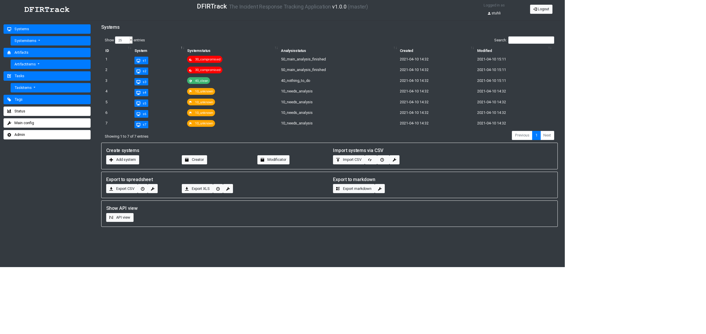

# DFIRTrack

DFIRTrack (Digital Forensics and Incident Response Tracking application) is an open source web application mainly based on [Django](https://www.djangoproject.com/) using a [PostgreSQL](https://www.postgresql.org/) database back end.

In contrast to other great incident response tools, which are mainly case-based and support the work of CERTs, SOCs etc. in their daily business, DFIRTrack is focused on handling one major incident with a lot of affected systems as it is often observed in APT cases.
It is meant to be used as a tool for dedicated incident response teams in large cases.
So, of course, CERTs and SOCs may use DFIRTrack as well, but they may feel it will be more appropriate in special cases instead of every day work.

In contrast to case-based applications, DFIRTrack works in a system-based fashion.
It keeps track of the status of various systems and the tasks and forensic artifacts associated with them, keeping the analyst well-informed about the status and number of affected systems at any time during the investigation phase up to the remediation phase of the incident response process.

## Features

One focus is the fast and reliable import and export of systems and associated information.
The goal for importing systems is to provide a fast and error-free procedure.
Moreover, the goal for exporting systems and their status is to have multiple instances of documentation: for instance, detailed Markdown reports for technical staff vs. spreadsheets for non-technical audiences without redundancies and deviations in the data sets.

The following functions are implemented for now:

* Importer
    * Creator (fast creation of multiple related instances via web interface) for systems and associated tasks and tags,
    * CSV (modifiable CSV based import, should fit for the export capabilities of many tools).
* Exporter
    * Markdown for so-called system reports (for use in a [MkDocs](https://www.mkdocs.org/) structure),
    * Spreadsheet for systems (CSV and XLS) and artifacts (XLS).
* Modificator
    * quick change of status of systems.

## Installation

DFIRTrack is developed for deploying on **Ubuntu**.
Other distributions may work but were not tested yet.
At the moment the project will be focused on Ubuntu LTS releases.

For fast and uncomplicated installation on a dedicated server including all dependencies an [Ansible](https://docs.ansible.com/ansible/latest/) playbook and role were written (available in `ansible`).
For information about deployment with Ansible look at the  [Wiki - Ansible](https://github.com/stuhli/dfirtrack/wiki/Ansible).

For testing a docker environment was prepared (see [Wiki - Docker](https://github.com/stuhli/dfirtrack/wiki/Docker)).

For installation with your own setup or for testing look at the [Wiki - Installation](https://github.com/stuhli/dfirtrack/wiki/Installation).

## Built-in software

The application was created by implementing the following libraries and code:

* [Bootstrap](https://github.com/twbs/bootstrap)
* [clipboard.js](https://github.com/zenorocha/clipboard.js)
* [DataTables](https://github.com/DataTables/DataTables)
* [jQuery](https://github.com/jquery/jquery)
* [Open Iconic](https://github.com/iconic/open-iconic)
* [Popper.js](https://github.com/FezVrasta/popper.js)
* [django-async-messages](https://github.com/codeinthehole/django-async-messages)

## Development

There are two main branches:

* `master` 
* `develop` 

The master branch should be stable.
New features and changes are added to the develop branch and merged into master from time to time.
Everything merged into develop should run too but might need manual changes.
So if you want to see the latest features and progress: "check out" develop.

## License

See `LICENSE` file in the root directory.

## Disclaimer

Even if some basic error checking is implemented, as of now the usage of DFIRTrack mainly depends on proper handling.

*DFIRTrack was not and most likely will never be intended for usage on publicly available servers. Nevertheless some basic security features were implemented (in particular in connection with the corresponding ansible role) always install DFIRTrack in a secured environment (e. g. a dedicated virtual machine or in a separated network)!*
